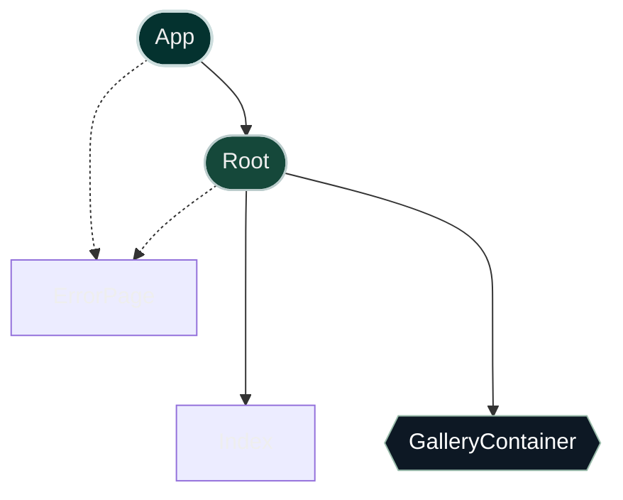

# ``tma-react-gallery``

Gallery viewer for TMA meetups. Made with React.

## Component Graph for Gallery Pages

```mermaid

graph TD
    %% Flowchart %%
    App([App])
    App --> Root([Root])

    Root --> GC{{GalleryContainer}}
    
    GC -..-> Gwy[Gateway]
    Gwy -..-> G

    GC --> G[Gallery]

    G ---> HD(Header)
    G ---> DS(Display)

    HD ----> mn_b(MenuButton)
    HD ---> nv(Navigation)
    HD ----> dt(Details)

    nv --> nv_b(NavButton)

    mn_b -. "setMode()"  ....-> G
    nv_b -. "setMedia()" ...-> G


    %% Styling %%
    classDef app color:#eee,fill:#04322f,stroke:#cdd,stroke-width:2px;
    class App app;

    classDef root color:#eee,fill:#15483A,stroke:#bcc,stroke-width:1.5px;
    class Root root;

    classDef container color:#fff,fill:#0d1824,stroke:#9ba;
    class GC container;
    
    classDef helper fill:#382c2c,stroke:#a88686;
    class mn_b,nv_b helper;

    linkStyle 10,11 stroke:#999,stroke-width:0.75px,stroke-dasharray:3,color:MediumTurquoise;
```

## Routing Graph

```mermaid

graph TD
    %% Flowchart %%
    App([App])

    App --> Root([Root])
    App -.-> Err[ErrorPage]

    Root -.-> Err

    Root ---> Index[Index]
    Root ---> GC{{GalleryContainer}}


    %% Styling %%
    classDef app color:#eee,fill:#04322f,stroke:#cdd,stroke-width:2px;
    class App app;

    classDef root color:#eee,fill:#15483A,stroke:#bcc,stroke-width:1.5px;
    class Root root;

    classDef container color:#fff,fill:#0d1824,stroke:#9ba;
    class GC container;
```