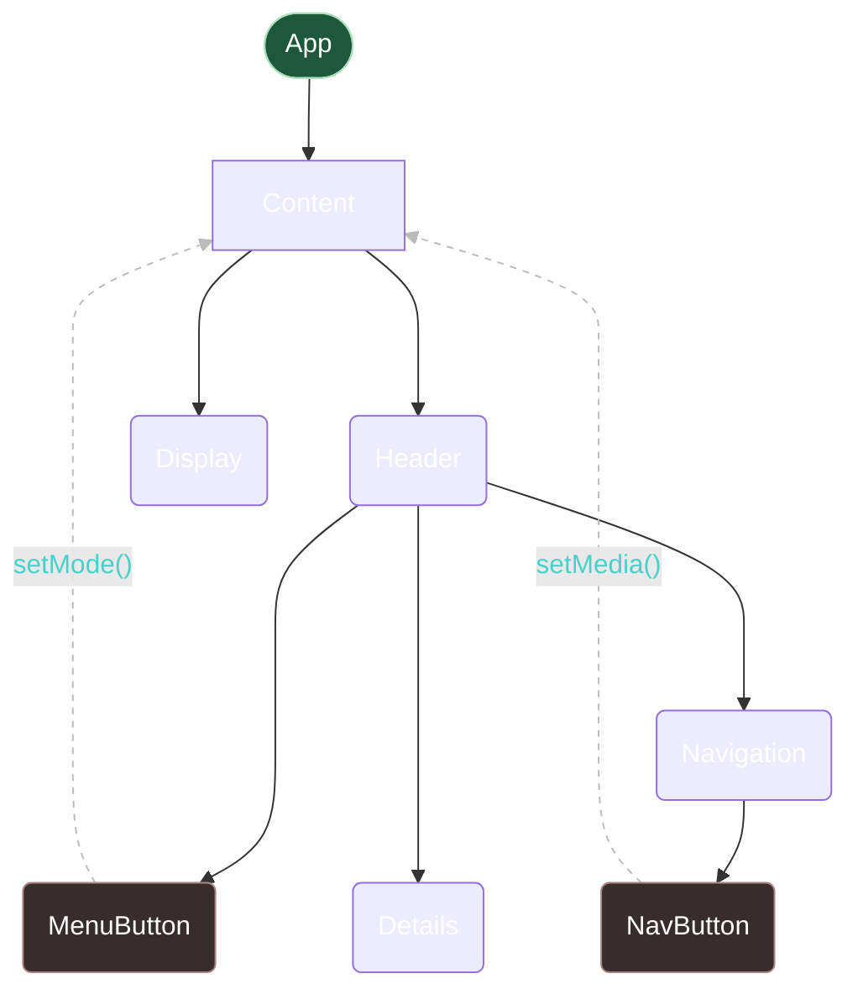

```mermaid

graph TD
    %% Flowchart %%
    A([App])
    
    A --> C[Content]

    C ---> HD(Header)
    C ---> DS(Display)

    HD ----> mn_b(MenuButton)
    HD ---> nv(Navigation)
    HD ----> dt(Details)

    nv --> nv_b(NavButton)

    mn_b -. "setMode()"  ....-> C
    nv_b -. "setMedia()" ...-> C


    %% Styling %%
    classDef root color:#fff,fill:#1d583a,stroke:#adb;
    class A root;
    
    classDef helper fill:#382c2c,stroke:#a88686;
    class mn_b,nv_b helper;

    linkStyle 7,8 stroke:#bbb,stroke-width:1px,stroke-dasharray:4,color:MediumTurquoise;

```