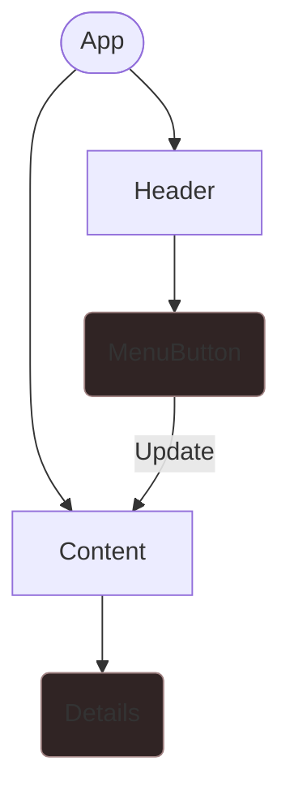

```mermaid

graph TD
    A([App])
    A --> H[Header]
    A --> C[Content]
    H --> M(MenuButton)
    style M fill:#302424, stroke:#a08282;
    C --> D(Details)
    style D fill:#302424, stroke:#a08282;

    M --> |Update| C

```