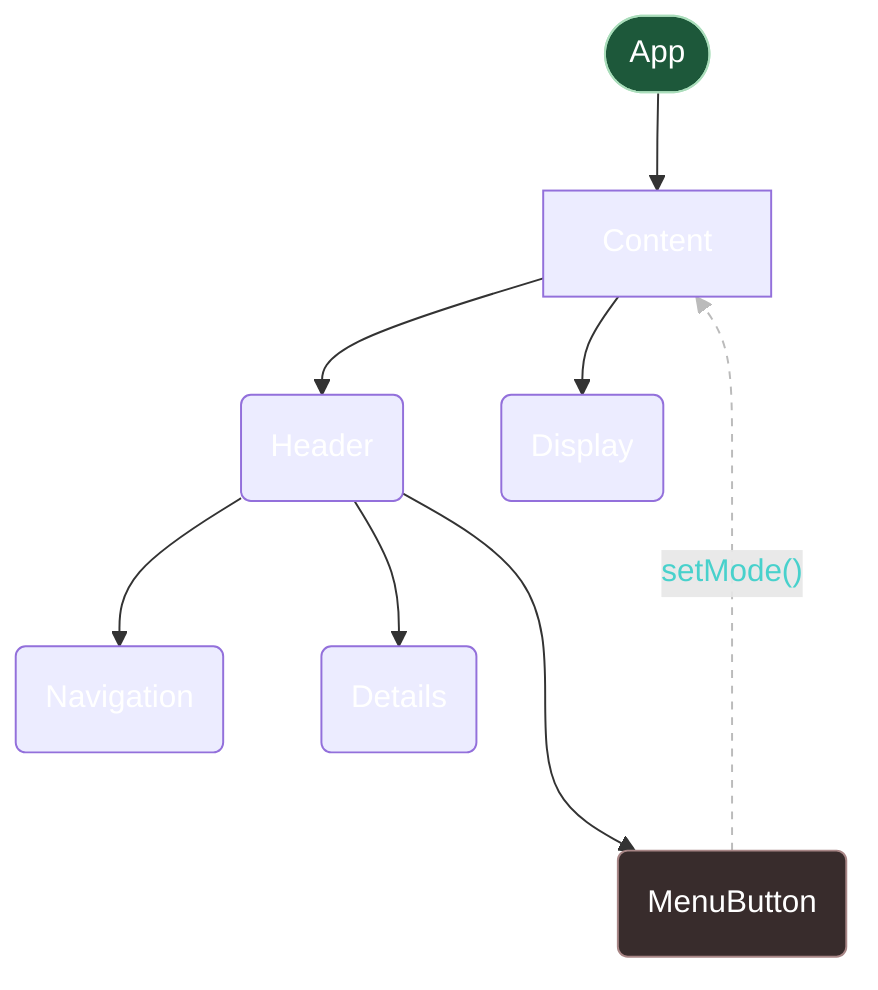

```mermaid

graph TD
    %% Flowchart %%
    A([App])
    
    A --> C[Content]

    C --> HD(Header)
    C --> DS(Display)

    HD ---> mb(MenuButton)
    HD --> nv(Navigation)
    HD --> dt(Details)
    
    mb -. "setMode()" .-> C


    %% Styling %%
    classDef root color:#fff,fill:#1d583a,stroke:#adb;
    class A root;
    
    classDef helper fill:#382c2c,stroke:#a88686;
    class mb helper;

    linkStyle 6 stroke:#bbb,stroke-width:1px,stroke-dasharray:4,color:MediumTurquoise;

```