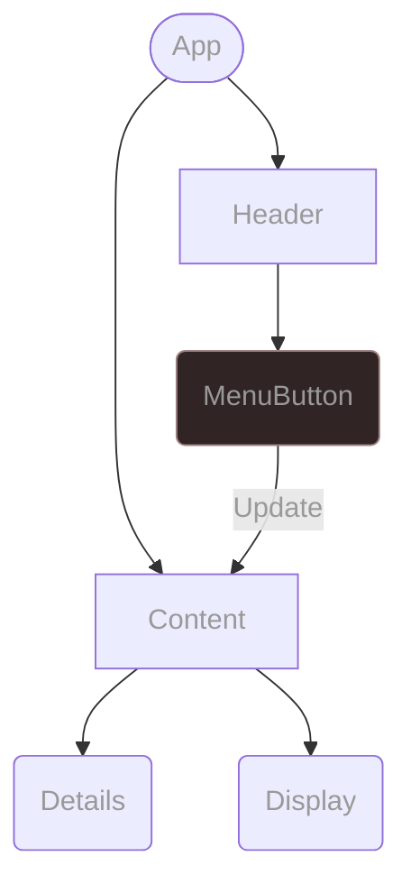

```mermaid

graph TD
    %% Flowchart %%
    A([App])
    
    A --> H[Header]
    A --> C[Content]
    H --> mb(MenuButton)
    
    C --> DT(Details)
    C --> DS(Display)
    
    mb --> |Update| C


    %% Styling %%
    classDef helper fill:#302424,stroke:#a08282;
    class mb helper;

    classDef root color:#999;
    class A root;

```